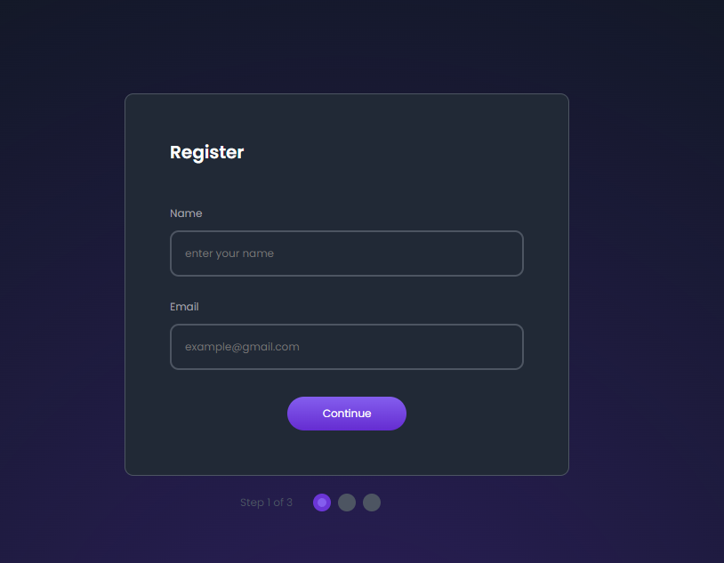
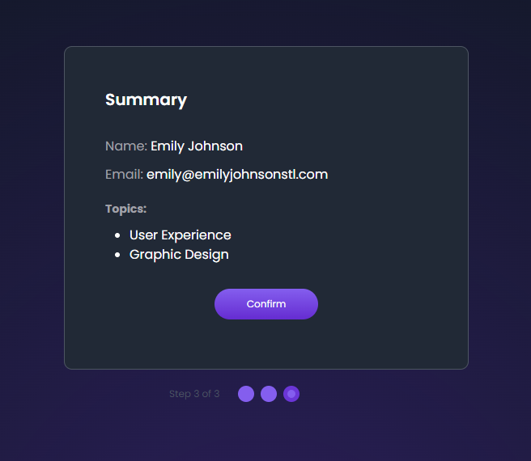

# Multistep Plataform by MaxiDev!

Muy buenas, este mi primer desafió para JavaScript Developer, este consiste en realizar una plataforma de registro mediante 3 pasos.  

PASO 1 -> 
PASO 2 -> 
PASO 3 -> 

-> Ver Pagina Aqui https://multistep-plataform.netlify.app/index.html